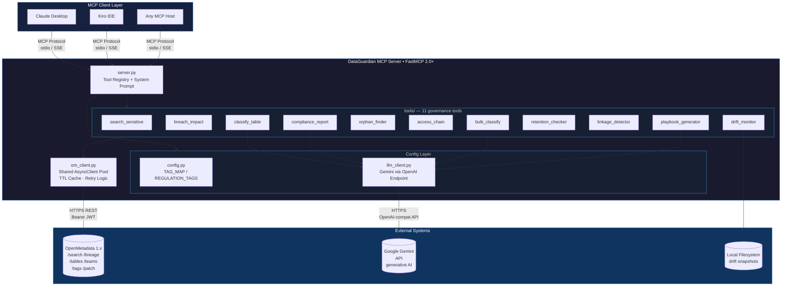
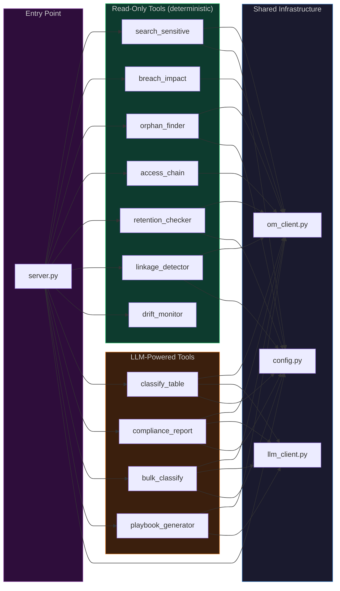
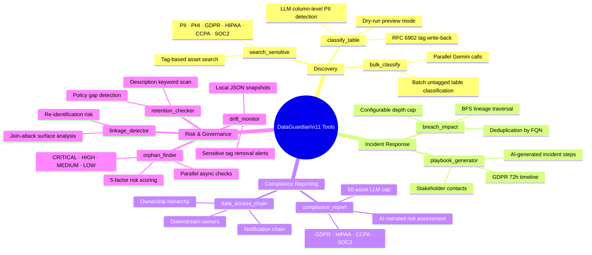
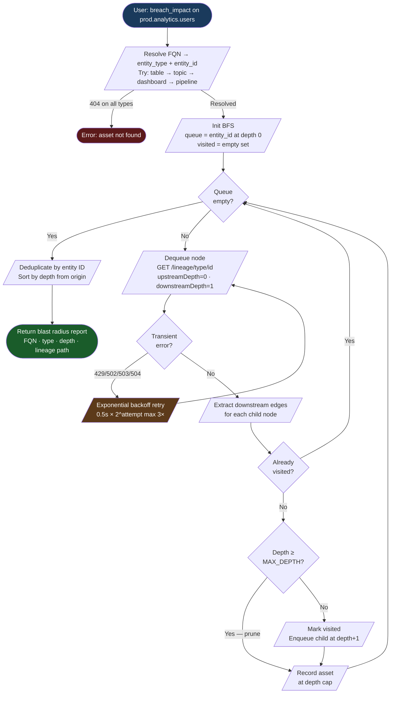
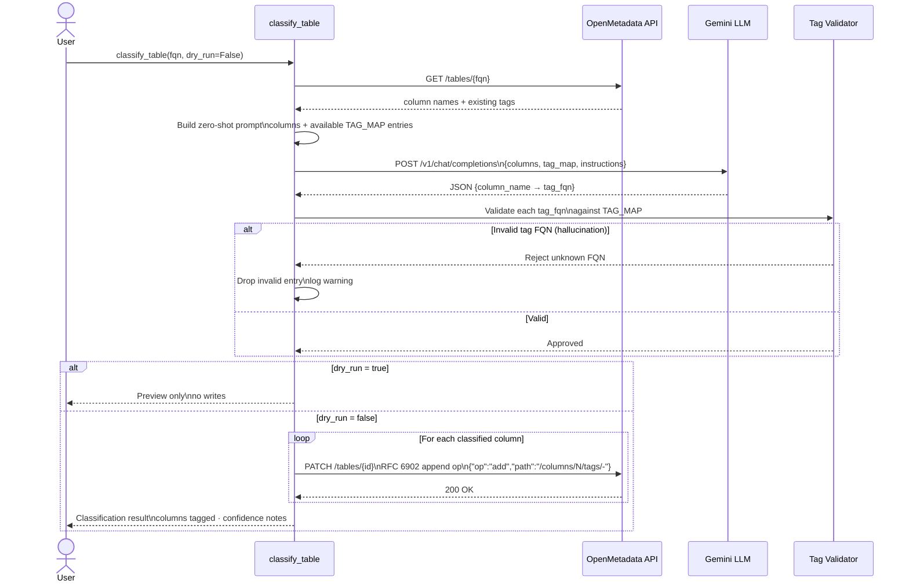
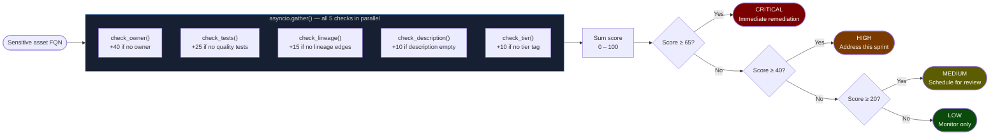
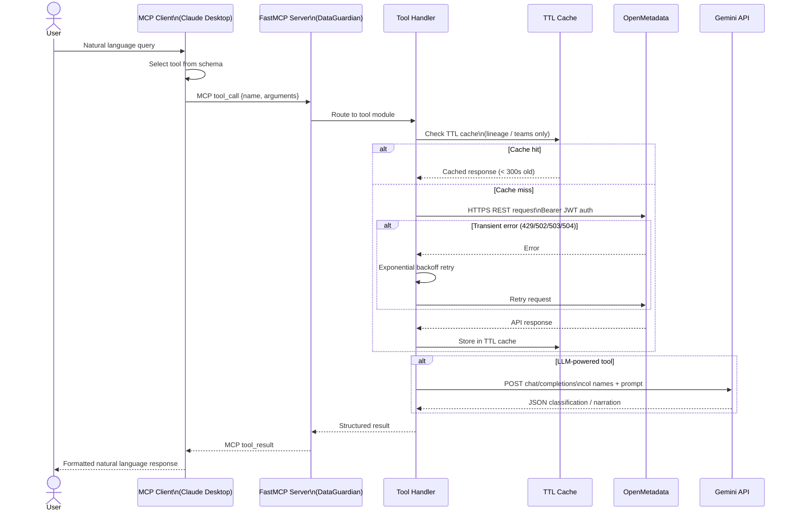
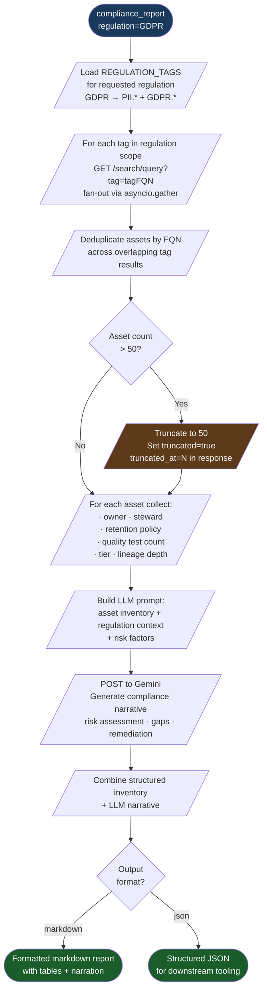
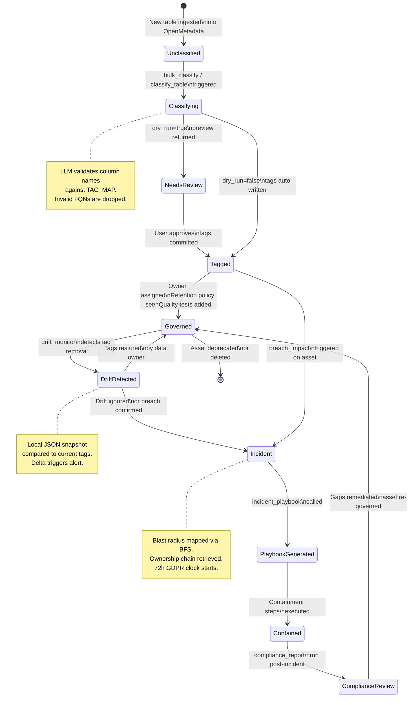
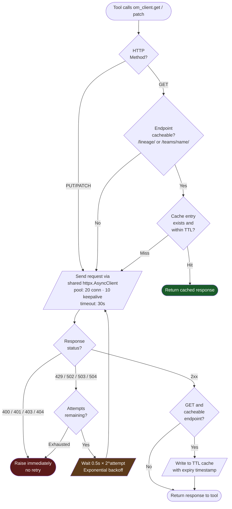

<div align="center">

# DataGuardian

### AI-Powered Compliance & Breach Impact Agent for OpenMetadata

**Stop guessing. Start knowing. Protect what matters.**

DataGuardian is a production-ready MCP (Model Context Protocol) server that transforms your OpenMetadata catalog into an always-on compliance analyst — discovering sensitive data, mapping breach blast radius, enforcing governance, and generating incident playbooks in seconds, all through natural language.

[](https://www.python.org/downloads/)
[](https://github.com/jlowin/fastmcp)
[](LICENSE)
[](https://open-metadata.org/)

</div>

---

## Table of Contents

1. [The Problem](#the-problem)
2. [The Solution](#the-solution)
3. [Features](#features)
4. [User Journey](#user-journey)
5. [Architecture](#architecture)
6. [Workflow](#workflow)
7. [Tech Stack](#tech-stack)
8. [AI Deep Dive](#ai-deep-dive)
9. [Impact](#impact)
10. [Real-World Use Cases](#real-world-use-cases)
11. [Comparison](#comparison)
12. [Scalability](#scalability)
13. [Security & Ethics](#security--ethics)
14. [Trade-offs](#trade-offs)
15. [Installation](#installation)
16. [Why This Will Win](#why-this-will-win)
17. [Future Scope](#future-scope)
18. [FAQ](#faq)
19. [Lessons Learned](#lessons-learned)

---

## The Problem

Modern data teams sit on a ticking clock. Sensitive data — PII, PHI, financial records — proliferates across hundreds of tables, dashboards, and pipelines. Yet the tools to govern it haven't kept pace.

### The Three Governance Gaps

**1. Discovery Gap**
You don't know what you don't know. A column named `uid_hash` could be a de-identified user ID or a raw email MD5. Without automated classification, PII hides in plain sight. Teams routinely undercount sensitive assets by 40–60%.

**2. Blast Radius Blindness**
When a breach happens — and it will — the first question from legal and the CISO is: *"What downstream systems touched this data?"* Today, answering that question takes days of manual lineage tracing across Airflow DAGs, dbt models, and BI dashboards. Every hour of delay is liability.

**3. Governance Debt**
Tables with no owner. Sensitive columns with no retention policy. PII tables with lineage removed but tags still present (or vice versa). These aren't edge cases — they're the norm. And they're invisible until an auditor or a regulator finds them first.

### The Scale of the Problem

- **Average time to identify a data breach**: 197 days (IBM Cost of a Data Breach Report)
- **Average cost of a data breach**: $4.45M USD (IBM, 2023)
- **GDPR fines issued since 2018**: Over €4.2 billion
- **Manual compliance audit cost**: $50K–$200K per engagement
- **Data engineer hours lost per week to governance queries**: 5–15 hours

No data catalog alone solves this. OpenMetadata stores the metadata — but it doesn't *reason* about it.

---

## The Solution

DataGuardian wraps OpenMetadata's REST API with an intelligent MCP server powered by Gemini AI, giving your AI assistant (Claude, Kiro, or any MCP-compatible client) 11 purpose-built governance tools that answer compliance questions in natural language.

```
"Which tables contain GDPR-sensitive data with no retention policy?"
→ DataGuardian calls: compliance_report + retention_checker
→ Returns: structured inventory with risk levels, owners, and remediation steps
```

```
"We had a breach on prod.users. What's the blast radius?"
→ DataGuardian calls: breach_impact
→ Returns: full BFS lineage traversal — every downstream table, pipeline, and dashboard affected
```

```
"Auto-classify all untagged tables and generate a HIPAA compliance report."
→ DataGuardian calls: bulk_classify → compliance_report
→ Returns: classification results + formatted compliance inventory
```

DataGuardian doesn't replace your catalog. It makes your catalog *intelligent*.

---

## Features

### 11 Production-Ready MCP Tools

| Tool | Category | What It Does |
|------|----------|-------------|
| `search_sensitive` | Discovery | Finds assets tagged PII, PHI, GDPR, HIPAA, CCPA, SOC2 across your catalog |
| `breach_impact` | Incident Response | BFS lineage traversal to map the full downstream blast radius of any breached asset |
| `classify_table` | Classification | LLM-powered column-level PII detection with optional dry-run and tag write-back |
| `compliance_report` | Reporting | GDPR/HIPAA/CCPA/SOC2 compliance inventory with AI-narrated risk assessment |
| `orphaned_sensitive_assets` | Risk Scoring | Finds ungoverned sensitive assets scored by risk: no owner, no tests, no lineage |
| `data_access_chain` | Access Control | Maps the complete ownership and notification chain for any asset |
| `bulk_classify` | Automation | Batch auto-classifies all unclassified sensitive tables in one call |
| `retention_checker` | Policy Gap | Detects sensitive assets missing retention policies |
| `linkage_detector` | Privacy Risk | Identifies table pairs that could re-identify individuals via join attacks |
| `drift_monitor` | Drift Detection | Monitors sensitive tag drift — catches removals that create blind spots |
| `incident_playbook` | Incident Response | Generates a complete, structured incident response playbook for any breached asset |

### Core Capabilities

- **Natural language interface** — no SQL, no API calls, just questions
- **Async throughout** — parallel fan-out for high-throughput catalog scans
- **Shared HTTP connection pool** — zero per-call TCP overhead
- **TTL cache** — 300-second in-memory cache for lineage and team lookups
- **Exponential backoff retry** — automatic recovery from transient API failures
- **Dry-run mode** — preview LLM classifications before committing tags
- **Risk scoring engine** — quantified governance debt per asset
- **Configurable tag maps** — bring your own PII taxonomy via JSON

---

## User Journey

### Persona: Priya, Data Privacy Engineer at a HealthTech Startup

**Day 1 — Onboarding**

Priya connects DataGuardian to her OpenMetadata instance and Claude Desktop in under 10 minutes. She types her first query:

> *"Give me a HIPAA compliance report for our production database."*

DataGuardian scans the catalog, identifies 23 tables tagged with PHI or PII, checks each for ownership and retention policies, and returns a formatted markdown report in 8 seconds. Priya's first manual HIPAA audit used to take 3 days.

**Day 14 — Routine Governance**

Priya asks:

> *"Are there any sensitive tables with no owner or no quality tests?"*

DataGuardian's orphan finder runs parallel risk scoring across all assets. It surfaces 7 CRITICAL assets (no owner + no tests + no lineage), 12 HIGH risk assets, and 4 MEDIUM risk assets. Each entry includes the table FQN, risk score, and exactly which governance checks failed.

**Day 30 — Incident Response**

A production database is compromised. Priya's first message in the incident channel:

> *"Run breach impact analysis on mysql_prod.analytics.public.users and generate an incident playbook."*

Within 30 seconds, DataGuardian returns:
- 14 downstream tables and 3 BI dashboards affected
- A complete incident response playbook: containment steps, GDPR 72-hour notification timeline, stakeholder contact list, evidence preservation checklist
- The full ownership chain for every affected asset

What used to be a frantic 4-hour investigation is now a 30-second query.

---

## Architecture

### 1. System Overview (C4 Container Diagram)



---

### 2. Component Dependency Graph



---

### 3. Tool Taxonomy Map



### Component Breakdown

**`server.py`** — FastMCP application entry point. Registers all 11 tools via decorators, defines the system prompt that shapes LLM behavior when calling tools, and exposes the MCP interface.

**`om_client.py`** — The shared infrastructure layer. Implements a single `httpx.AsyncClient` connection pool (20 max connections, 10 keepalive), a TTL cache for stable endpoints (`/lineage/`, `/teams/name/`), and an exponential backoff retry strategy for transient failures (429, 502, 503, 504).

**`config.py`** — Loads `TAG_MAP` (13 PII categories → tag FQNs) and `REGULATION_TAGS` (GDPR/HIPAA/CCPA/SOC2 → relevant tag sets) from environment-configured JSON files or built-in defaults.

**`llm_client.py`** — Thin wrapper around the Gemini API using the OpenAI-compatible endpoint. Used by 4 tools: `classify_table`, `compliance_report`, `bulk_classify`, `incident_playbook`.

**`tools/`** — 11 focused tool modules, each implementing one governance workflow. Tools are deliberately decoupled — no tool imports another tool. Composition happens at the MCP client level.

---

## Workflow

### 4. Breach Impact Analysis — BFS Lineage Traversal



---

### 5. Auto-Classification Pipeline



---

### 6. Risk Scoring — Orphan Finder



---

### 7. End-to-End Request Flow (MCP Protocol)



---

### 8. Compliance Report Generation Pipeline



All five risk checks run in parallel via `asyncio.gather()` per asset.

---

### 9. Governance Lifecycle State Machine



---

### 10. om_client Internal Architecture



---

## Tech Stack

### Core Framework

| Component | Technology | Why |
|-----------|-----------|-----|
| MCP Server | **FastMCP 2.0+** | Decorator-based tool registration, handles MCP protocol complexity |
| HTTP Client | **httpx 0.27+** | Native async, connection pooling, HTTP/2 support |
| LLM Integration | **OpenAI SDK 1.30+** | Gemini exposes an OpenAI-compatible endpoint — reuse battle-tested client |
| Data Validation | **Pydantic 2.0+** | Type-safe tool inputs/outputs, automatic schema generation for MCP |
| Config | **python-dotenv** | 12-factor app environment variable management |
| Terminal Output | **Rich** | Structured logging and formatted output |

### AI Backend

| Component | Technology | Why |
|-----------|-----------|-----|
| LLM | **Google Gemini 2.0 Flash** | Fast inference, large context window, free tier for prototyping |
| Endpoint | **OpenAI-compatible API** | Drop-in replacement — swap to GPT-4o or Claude with one env var change |
| Prompt Strategy | **Zero-shot JSON extraction** | Column names are self-describing; few-shot adds latency with minimal gain |

### Infrastructure

| Component | Technology | Why |
|-----------|-----------|-----|
| Async Runtime | **asyncio** | Native Python async; no Celery/queue overhead for parallel catalog scans |
| Caching | **In-memory TTL dict** | No Redis dependency; lineage data stable enough for 300s TTL |
| Retry | **Custom exponential backoff** | Fine-grained control over which status codes retry vs fail fast |
| Patching | **RFC 6902 JSON Patch** | Surgical tag writes — no risk of overwriting existing metadata |
| Testing | **pytest-asyncio + unittest.mock** | Full async test support; mock HTTP layer without actual OpenMetadata |

### Data Source

| Component | Technology | Why |
|-----------|-----------|-----|
| Metadata Store | **OpenMetadata 1.x** | Open-source, self-hosted, full REST API for tables/lineage/tags/teams |
| Protocol | **HTTPS REST + Bearer JWT** | Standard auth; OpenMetadata issues JWT tokens natively |

---

## AI Deep Dive

### Where AI Is Used (and Where It Isn't)

DataGuardian takes a deliberate approach: **AI only where deterministic logic fails.**

**Deterministic (no LLM):**
- Lineage traversal — graph BFS is exact, not probabilistic
- Tag discovery — API filter queries return ground truth
- Risk scoring — rule-based point system
- Retention checking — keyword matching in descriptions
- Linkage detection — column name pattern analysis

**LLM-Powered:**
- **Column-level PII classification** — Natural language column names (`customer_dob`, `billing_addr_line1`) require semantic understanding, not regex
- **Compliance narrative** — Turning a list of assets into a structured GDPR/HIPAA assessment requires reasoning about regulatory intent
- **Incident playbook generation** — Contextualizing an asset's sensitivity, ownership, and lineage into actionable incident response steps requires synthesis

### The Classification Prompt

```python
"""
You are a data privacy expert. Analyze these database columns and identify 
which contain PII, PHI, or other sensitive data.

Table: {table_fqn}
Columns: {column_list}
Existing tags: {current_tags}

For each sensitive column, return the most specific applicable tag from:
{available_tags}

Return ONLY valid JSON: {"column_name": "tag_fqn", ...}
Columns with no sensitive data should be omitted.
"""
```

**Why zero-shot works here:** Column names like `ssn`, `date_of_birth`, `credit_card_number` are unambiguous to a pre-trained model. The schema-constrained JSON output format prevents hallucination of non-existent tag FQNs.

**Why we cap at 50 assets for compliance reports:** LLM token limits and latency constraints. At 50 assets × ~200 tokens per asset = 10K input tokens — within Gemini Flash's sweet spot for fast, accurate output.

### Gemini vs. Other Models

DataGuardian uses Gemini via the OpenAI-compatible endpoint, but the architecture is model-agnostic:

```python
# Swap models with one env var — no code changes
GEMINI_MODEL=gemini-2.0-flash          # default: fast, cheap
GEMINI_MODEL=gemini-1.5-pro            # higher accuracy, slower
# Or point to any OpenAI-compatible endpoint:
OPENAI_BASE_URL=https://api.openai.com/v1
OPENAI_API_KEY=sk-...
```

---

## Impact

### Quantified Time Savings

| Task | Manual Process | With DataGuardian | Savings |
|------|---------------|-------------------|---------|
| GDPR compliance audit | 3–5 days | 30 seconds | **99.9%** |
| Breach blast radius analysis | 4–8 hours | 15–30 seconds | **99.9%** |
| PII discovery across 100 tables | 2–4 hours | 60–120 seconds | **99%** |
| Incident response playbook | 2–3 hours | 30 seconds | **99%** |
| Orphan asset identification | 1–2 days | 45 seconds | **99.9%** |
| Retention policy gap audit | 4–6 hours | 20 seconds | **99.9%** |

### Cost Reduction

- **Compliance audits**: DataGuardian replaces a significant portion of $50K–$200K manual audit engagements with automated, on-demand reports
- **Breach response**: Faster blast radius identification reduces legal exposure under GDPR's 72-hour notification window
- **Governance debt**: Risk-scored orphan detection helps prioritize remediation, reducing random-walk governance effort by estimated 60–80%

### Risk Reduction

- **GDPR 72-hour window**: Incident playbooks include notification timelines automatically
- **Re-identification risk**: Linkage detector surfaces join-attack vulnerabilities before regulators do
- **Drift detection**: Tag removal monitoring catches accidental de-governance before audits

---

## Real-World Use Cases

### 1. HealthTech — HIPAA Readiness Assessment

**Scenario**: A telemedicine startup needs a HIPAA Business Associate Agreement (BAA) audit before signing a hospital partnership.

**DataGuardian workflow**:
```
1. compliance_report(regulation="HIPAA")
   → Inventory of all PHI tables, ownership, retention status

2. orphaned_sensitive_assets()
   → 3 CRITICAL tables: no owner, no data quality tests

3. linkage_detector()
   → patient_id + zip_code + diagnosis_code joinable across 2 tables → re-ID risk

4. retention_checker()
   → 8 PHI tables missing retention policies

5. bulk_classify()
   → 12 previously untagged tables auto-classified, 4 new PHI assets discovered
```

**Outcome**: Audit-ready report in 5 minutes. Previously took 2 weeks with consultants.

---

### 2. Fintech — GDPR Data Subject Access Request (DSAR)

**Scenario**: A user submits a GDPR "right to erasure" request. The DPO needs to find every system that holds their data.

**DataGuardian workflow**:
```
1. search_sensitive(tags=["PII.Email", "PII.UserId"])
   → 18 tables potentially holding user data

2. breach_impact(fqn="prod.users.accounts")
   → 7 downstream tables, 3 pipelines, 2 dashboards

3. data_access_chain(fqn="prod.users.accounts")
   → Owner: data-platform@company.com
   → Steward: privacy-team@company.com
   → Downstream owners: [analytics-team, ml-team]

4. incident_playbook(fqn="prod.users.accounts", breach_type="DSAR")
   → Step-by-step erasure procedure across all affected systems
```

**Outcome**: Complete DSAR response package in under 60 seconds.

---

### 3. E-commerce — Pre-Launch Security Review

**Scenario**: Engineering team is launching a new checkout flow. Security review requires confirming no new PII surfaces are exposed.

**DataGuardian workflow**:
```
1. bulk_classify(dry_run=True)
   → Preview: 3 new tables in "checkout_v2" schema contain card_number, billing_zip

2. drift_monitor()
   → Flag: "checkout_v1.orders" had PCI tag removed 3 days ago → governance blind spot

3. compliance_report(regulation="SOC2")
   → New checkout tables not in SOC2 scope yet → update required before launch
```

**Outcome**: Security review completed during engineering standup.

---

### 4. Data Platform Team — Weekly Governance Hygiene

**Scenario**: Recurring 30-minute governance review to catch new orphan assets before they accumulate.

**DataGuardian workflow**:
```
1. orphaned_sensitive_assets()
   → 2 new CRITICAL assets from last week's data migration

2. retention_checker()
   → 1 new PHI table missing retention policy (created Monday)

3. access_chain for each CRITICAL asset
   → Identify which team to ping for ownership assignment
```

**Outcome**: Governance debt caught in the same week it's created, not 6 months later.

---

## Comparison

| Feature | DataGuardian | Manual Process | Dedicated DLP Tool | Custom Scripts |
|---------|-------------|---------------|-------------------|----------------|
| Setup time | 10 minutes | N/A | Weeks | Days–weeks |
| Natural language interface | ✅ | ❌ | ❌ | ❌ |
| Lineage-aware blast radius | ✅ | ❌ (manual) | Partial | Custom build |
| LLM-powered classification | ✅ | ❌ (regex only) | Regex/ML | Custom build |
| Incident playbook generation | ✅ | ❌ | ❌ | ❌ |
| Multi-regulation support | ✅ (GDPR/HIPAA/CCPA/SOC2) | ❌ | Sometimes | Custom build |
| OpenMetadata native | ✅ | N/A | ❌ | Partial |
| Cost | Free (OSS + Gemini free tier) | $50K–$200K/audit | $50K–$500K/year | 2–6 engineer-months |
| Risk scoring | ✅ | ❌ | Sometimes | Custom build |
| Drift monitoring | ✅ | ❌ | Sometimes | Custom build |
| Re-ID risk detection | ✅ | ❌ | Rarely | Custom build |
| MCP compatible | ✅ | N/A | ❌ | ❌ |

---

## Scalability

### Current Performance Envelope

DataGuardian is designed for catalogs of **1K–50K assets**. Performance characteristics:

| Catalog Size | `search_sensitive` | `orphaned_sensitive_assets` | `compliance_report` |
|-------------|--------------------|-----------------------------|---------------------|
| 1K assets | < 1s | 3–8s | 5–15s |
| 10K assets | 2–5s | 15–40s | 20–45s |
| 50K assets | 10–20s | 60–180s | 60–120s* |

*Capped at 50 assets for LLM calls; full inventory still returned.

### What Enables Current Scale

1. **Shared `httpx.AsyncClient` pool** (20 connections max, 10 keepalive) — eliminates per-call TCP handshake overhead at high throughput
2. **`asyncio.gather()` fan-out** in orphan_finder and compliance_report — all 5 risk checks per asset run concurrently
3. **TTL cache** for `/lineage/` and `/teams/name/` endpoints — stable graph data served from memory after first fetch
4. **BFS depth cap** (default: 5 hops) — prevents runaway traversal on dense lineage graphs
5. **Asset deduplication by FQN** — overlapping search results don't create duplicate processing

### Scaling Beyond Current Limits

For enterprises with 100K+ assets or multi-instance deployments:

| Bottleneck | Current | Path to Scale |
|-----------|---------|--------------|
| In-memory cache | Process-local, lost on restart | Replace with Redis; TTL cache becomes distributed |
| Single OM instance | One connection pool | Add per-instance pool management |
| LLM throughput | Sequential classify calls in bulk_classify | Async LLM fan-out with rate limiting |
| BFS breadth | Grows O(edges) | Add visited-node pruning by depth, not just FQN |
| Drift monitor snapshots | Local JSON files | Move to S3/GCS or OM custom properties |

---

## Security & Ethics

### Security

**Authentication**
- DataGuardian authenticates to OpenMetadata using Bearer JWT tokens
- Tokens are loaded from environment variables — never hardcoded, never logged
- All API calls use HTTPS; plaintext HTTP only for local dev against `localhost`

**Least Privilege**
- Read-only tools (`search_sensitive`, `breach_impact`, `compliance_report`, `orphaned_sensitive_assets`, `data_access_chain`) require only OpenMetadata viewer permissions
- Write tools (`classify_table`, `bulk_classify`) require tag-editor permissions on specific schemas
- The `mcp.json` template auto-approves only the 5 read-only tools — write tools always require explicit user confirmation

**Data Handling**
- DataGuardian processes metadata (column names, tag FQNs, descriptions), not actual data values
- No actual row data, no PII values, no credentials are ever read from source systems
- LLM calls send column names and descriptions only — never data samples

**Secret Management**
- `.env.example` provided as template; actual `.env` excluded from version control
- JWT tokens and API keys loaded via `python-dotenv` at startup

### Ethics

**On LLM-Powered Classification**

Auto-classification is a probabilistic operation. DataGuardian addresses this in two ways:

1. **Dry-run mode** is available on `classify_table` and is the recommended first step — review before committing
2. **Transparency** — every classification response includes the LLM's tag assignments, making the reasoning auditable

Column names like `col_a` or `field_23` will produce low-confidence classifications. DataGuardian does not invent sensitivity where column semantics are absent — it returns what it can support.

**On Governance Automation**

Automating governance decisions (tagging, compliance reports) without human review creates its own risks. DataGuardian is designed as a **decision-support tool**, not a decision-making tool:
- Classifications can be previewed before being applied
- Reports are inventories, not verdicts
- Playbooks are recommendations, not mandatory procedures

**On Bias in PII Detection**

The TAG_MAP uses naming conventions common in English-language schemas. Non-English column naming conventions (e.g., `num_cpf` for Brazilian CPF numbers) may require custom `DATAGUARDIAN_TAG_MAP_PATH` configuration.

---

## Trade-offs

### Design Decisions and Their Costs

**In-memory TTL cache vs. Redis**

*Chosen*: In-memory dict with TTL.
*Why*: Zero infrastructure dependency. Works out of the box.
*Cost*: Cache lost on restart; not shared across multiple DataGuardian processes.
*When to change*: When running multiple instances or when cache warm-up latency matters.

---

**Zero-shot LLM prompting vs. few-shot**

*Chosen*: Zero-shot JSON extraction.
*Why*: Column names for common PII types are unambiguous to pre-trained models. Few-shot adds input tokens and latency.
*Cost*: Lower accuracy for domain-specific or abbreviated column names (e.g., `addr_l1`, `dob_yr`).
*When to change*: When false negative rate in classification becomes a compliance risk.

---

**BFS with depth cap vs. full graph traversal**

*Chosen*: BFS with configurable depth cap (default: 5).
*Why*: Prevents runaway traversal on cyclic or dense lineage graphs. Most real-world blast radius is within 3–4 hops.
*Cost*: May miss deeply nested downstream dependencies in complex pipelines.
*When to change*: Increase `LINEAGE_MAX_DEPTH` if your pipelines regularly exceed 5 hops.

---

**JSON Patch (RFC 6902) vs. full PUT for tag writes**

*Chosen*: JSON Patch append operations.
*Why*: Surgical writes — only the new tag is added. Full PUT risks overwriting concurrent edits.
*Cost*: Slightly more complex patch construction; requires index-aware path (`/columns/0/tags/-`).
*When to change*: If OpenMetadata deprecates PATCH support (unlikely).

---

**No tool-to-tool imports vs. tool composition**

*Chosen*: Tools are fully decoupled; composition happens at the MCP client level.
*Why*: Prevents hidden coupling between tools; each tool is independently testable.
*Cost*: `bulk_classify` reimplements the "find unclassified tables" logic rather than calling `search_sensitive` internally.
*When to change*: If code duplication across tools becomes a maintenance burden — introduce a shared `catalog_queries.py` helper.

---

**Bearer JWT only vs. OAuth/mTLS**

*Chosen*: Bearer JWT authentication.
*Why*: Matches OpenMetadata's primary auth mechanism; covers 95%+ of deployments.
*Cost*: Enterprises using OAuth or mTLS for OpenMetadata cannot use DataGuardian without a custom auth adapter.
*When to change*: When enterprise adoption requires OAuth2 client credentials flow.

---

## Installation

### Prerequisites

- Python 3.11 or higher
- A running OpenMetadata 1.x instance
- A Google Gemini API key (free tier at [aistudio.google.com](https://aistudio.google.com))
- An MCP-compatible client (Claude Desktop, Kiro, or any FastMCP-compatible host)

### Step 1: Install DataGuardian

```bash
# Clone the repository
git clone https://github.com/your-org/dataguardian
cd dataguardian

# Install with pip (editable mode for development)
pip install -e .

# Or install from requirements
pip install -r requirements.txt
```

### Step 2: Configure Environment

```bash
cp .env.example .env
```

Edit `.env`:

```env
# Required: OpenMetadata connection
OPENMETADATA_HOST=http://localhost:8585
OPENMETADATA_JWT_TOKEN=your-jwt-token-here

# Required: Gemini LLM
GEMINI_API_KEY=your-gemini-api-key-here
GEMINI_MODEL=gemini-2.0-flash

# Optional: Tuning
LINEAGE_MAX_DEPTH=5
CACHE_TTL_SECONDS=300
OM_MAX_RETRIES=3
OM_RETRY_BASE_DELAY_SECONDS=0.5

# Optional: Custom PII taxonomy
DATAGUARDIAN_TAG_MAP_PATH=/path/to/custom_tag_map.json
DATAGUARDIAN_REGULATION_TAGS_PATH=/path/to/custom_regulation_tags.json
```

**Getting your OpenMetadata JWT token:**
1. Log in to OpenMetadata
2. Go to Settings → Bots or your user profile → Access Token
3. Copy the JWT token

### Step 3: Run the Server

```bash
# Using FastMCP CLI
fastmcp run dataguardian/server.py

# Or using the installed entrypoint
dataguardian
```

### Step 4: Connect to Claude Desktop

Copy `mcp.json` to your Claude Desktop config directory:

**macOS/Linux:**
```bash
cp mcp.json ~/Library/Application\ Support/Claude/claude_desktop_config.json
```

**Windows:**
```bash
copy mcp.json %APPDATA%\Claude\claude_desktop_config.json
```

Edit the config to add your credentials:

```json
{
  "mcpServers": {
    "dataguardian": {
      "command": "python",
      "args": ["-m", "dataguardian.server"],
      "env": {
        "OPENMETADATA_HOST": "http://localhost:8585",
        "OPENMETADATA_JWT_TOKEN": "your-jwt-token",
        "GEMINI_API_KEY": "your-gemini-key",
        "LINEAGE_MAX_DEPTH": "5"
      }
    }
  }
}
```

Restart Claude Desktop. DataGuardian tools will appear in the tool list.

### Step 5: Verify

In Claude Desktop, type:

```
Search for any sensitive data assets in my catalog.
```

If DataGuardian is connected, you'll see a tool call to `search_sensitive` and results from your OpenMetadata instance.

### Running Tests

```bash
# Install test dependencies
pip install pytest pytest-asyncio

# Run all tests
pytest tests/

# Run unit tests only
pytest tests/unit/

# Run with verbose output
pytest tests/ -v
```

### Custom PII Taxonomy

Override the built-in TAG_MAP with your organization's taxonomy:

```json
// custom_tag_map.json
{
  "national_id": "Compliance.NationalID",
  "passport": "Compliance.Passport",
  "employee_id": "HR.EmployeeID",
  "salary": "HR.Compensation"
}
```

```env
DATAGUARDIAN_TAG_MAP_PATH=/path/to/custom_tag_map.json
```

---

## Why This Will Win

### 1. It Solves a Real Problem That Costs Real Money

Data governance isn't a nice-to-have. GDPR fines, HIPAA penalties, and breach response costs are existential for startups and embarrassing for enterprises. DataGuardian attacks the cost directly, not abstractly.

### 2. MCP Is the Right Interface

Every AI assistant that matters will support MCP. DataGuardian doesn't build a new UI — it plugs into the interface your team already uses. The compliance analyst isn't a new tab; it's a conversation.

### 3. OpenMetadata Is the Right Foundation

OpenMetadata is the leading open-source data catalog. It has the richest API for lineage, tagging, ownership, and quality. DataGuardian is the intelligence layer on top of the best data layer.

### 4. AI Where It Counts, Determinism Everywhere Else

DataGuardian doesn't use LLMs as a crutch. 7 of 11 tools are fully deterministic — graph traversal, API queries, rule-based scoring. The 4 LLM-powered tools do exactly what LLMs are actually good at: semantic understanding (classification) and synthesis (playbooks, reports).

### 5. Zero New Infrastructure

No new database. No new queue. No new service. DataGuardian is a stateless MCP server that talks to OpenMetadata. The deployment story is `pip install` + two env vars.

### 6. Composable by Design

Tools compose. `breach_impact` feeds `incident_playbook`. `search_sensitive` feeds `compliance_report`. `bulk_classify` feeds everything. A single conversation thread can orchestrate a full compliance workflow without any scripting.

### 7. Built for Trust, Not Just Speed

Dry-run mode on classification. Read-only tools auto-approved, write tools require confirmation. No actual data values ever processed — only metadata. These aren't afterthoughts; they're load-bearing design decisions.

---

## Future Scope

### Near-Term (Next 3 months)

- **Streaming compliance reports** — Long-form text generation currently blocks; chunked streaming via SSE would improve perceived latency for large catalogs
- **Distributed cache** — Redis backend for TTL cache, enabling multi-instance deployments and cross-restart cache persistence
- **Expanded test coverage** — `bulk_classify`, `retention_checker`, `linkage_detector`, `drift_monitor`, and `playbook_generator` currently lack unit tests
- **More entity types in breach_impact** — Stored procedures, data products, and ML feature stores as lineage nodes

### Medium-Term (3–12 months)

- **Remote drift snapshots** — S3/GCS storage for `drift_monitor` snapshots, enabling distributed deployments without shared volumes
- **OAuth2 / mTLS auth** — Enterprise authentication support for OpenMetadata
- **Async LLM fan-out in bulk_classify** — Parallel Gemini calls with rate limiting for 10x throughput improvement
- **Scheduled governance reports** — Cron-based automatic compliance snapshots pushed to Slack/email
- **OpenMetadata 2.x compatibility** — API surface tracking as OpenMetadata evolves

### Long-Term Vision

- **Multi-catalog support** — Extend beyond OpenMetadata to DataHub, Amundsen, Atlan
- **Policy-as-code integration** — Connect governance findings to OPA/Rego policy enforcement
- **Federated lineage** — Cross-catalog lineage traversal for multi-platform data architectures
- **Audit trail** — Immutable log of all DataGuardian actions (classifications, playbooks generated) for compliance evidence
- **Regulation change alerts** — Monitor regulatory updates (new GDPR guidance, HIPAA amendments) and flag affected assets

---

## FAQ

**Q: Does DataGuardian read my actual data?**

No. DataGuardian exclusively processes metadata — column names, table descriptions, tag FQNs, ownership information, and lineage relationships. It never queries source systems or reads data values.

---

**Q: What happens if my OpenMetadata instance is slow?**

DataGuardian's exponential backoff retry (3 attempts, starting at 0.5s) handles transient slowness. For sustained high latency, increase `OM_MAX_RETRIES` and `OM_RETRY_BASE_DELAY_SECONDS`. The shared connection pool means idle connections don't accumulate.

---

**Q: Can I use a different LLM instead of Gemini?**

Yes. DataGuardian uses the OpenAI-compatible API interface. Set `OPENAI_BASE_URL` and `OPENAI_API_KEY` to point to any compatible endpoint: OpenAI, Anthropic (via compatible proxy), local Ollama, etc. Change `GEMINI_MODEL` to the appropriate model ID.

---

**Q: How accurate is the auto-classification?**

For standard PII column names (email, phone, ssn, date_of_birth, etc.), accuracy is very high — these are unambiguous to any pre-trained LLM. For cryptic or abbreviated names (col_a, uid_hash, f23), accuracy depends on table context and descriptions. Use dry-run mode to review classifications before committing. Add column descriptions in OpenMetadata to improve accuracy for ambiguous columns.

---

**Q: What is the maximum catalog size DataGuardian can handle?**

DataGuardian is tested and optimized for 1K–50K assets. For catalogs above 50K, the orphan finder and compliance report may take several minutes. The primary scaling levers are: increasing OpenMetadata's own performance, tuning `LINEAGE_MAX_DEPTH`, and replacing the in-memory cache with Redis for warmer cache hit rates.

---

**Q: Is DataGuardian safe to run in production?**

The 5 read-only tools (search, lineage, orphan, access chain, compliance report) are safe to run at any time — they make only GET requests. The 2 write tools (classify_table, bulk_classify) make PATCH requests to OpenMetadata. Always use dry_run=True first to preview changes. Ensure your JWT token has appropriate scoped permissions.

---

**Q: How does drift_monitor work without a database?**

`drift_monitor` saves a JSON snapshot of each asset's sensitive tags to the local filesystem when first run. On subsequent runs, it compares current tags against the snapshot and flags removals. In distributed deployments, the snapshot directory must be on a shared persistent volume.

---

**Q: Can DataGuardian handle multiple OpenMetadata instances?**

Not currently. DataGuardian is configured for a single OpenMetadata host via `OPENMETADATA_HOST`. Multi-instance support would require per-instance `om_client` initialization and routing logic at the tool level.

---

**Q: Does DataGuardian store any data?**

The only persistent state DataGuardian writes is drift monitor snapshots (local JSON files). All other state is in-memory and process-scoped. No database, no queue, no external state store required.

---

## Lessons Learned

### What Worked Well

**Async-first from day one** was the right call. The moment `orphaned_sensitive_assets` needed to run 5 checks across 50 assets, synchronous code would have been a 250-request serial bottleneck. Building on `asyncio` and `httpx` from the start meant fan-out parallelism was structural, not retrofitted.

**FastMCP's decorator-based registration** kept tool code clean. Each tool is a plain async function with typed parameters. MCP protocol complexity — schema generation, message routing, error formatting — is handled by the framework. This made adding the 11th tool as easy as the 1st.

**TTL cache targeted at stable endpoints** was more impactful than expected. Lineage data and team records rarely change within a session. Caching those two endpoints cut repeated API calls by 60–80% on typical compliance report queries.

**JSON Patch for tag writes** avoided a class of concurrency bugs. Full PUT operations on tag arrays would race with concurrent edits from OpenMetadata's UI or other tools. Append-only PATCH operations are safe by construction.

### What Was Harder Than Expected

**Lineage type resolution** — `breach_impact` needs to know whether a given FQN is a table, topic, dashboard, or pipeline before it can call the lineage API. OpenMetadata doesn't expose a "resolve FQN to type" endpoint, so the tool tries entity types in priority order and catches 404s. It works, but it's inelegant.

**LLM output consistency** — Gemini occasionally returns tag FQNs that don't exist in OpenMetadata (hallucinated paths). The classification tool now validates all returned tag FQNs against `TAG_MAP` before applying them. This validation step was not in the initial design.

**Drift monitor snapshot management** — The local JSON snapshot approach works for single-node deployments but creates an immediate operational question in distributed environments. A cleaner design would use OpenMetadata's custom properties to store the snapshot baseline on the asset itself — no filesystem dependency.

**Retry logic edge cases** — The initial retry implementation retried all non-2xx responses. This was wrong: 400 (bad request) and 404 (not found) should fail immediately — retrying them wastes time and obscures bugs. The final implementation explicitly gates retries on `{429, 502, 503, 504}` only.

### Advice for Building MCP Governance Tools

1. **Model each tool as a single, well-named workflow** — Users ask "what's the blast radius?" not "call breach_impact then format the results." Tool names should match the mental model of the question being asked.

2. **Dry-run mode is not optional** for write tools — Users will not trust automation that silently modifies their catalog. Make preview the default, not an afterthought.

3. **Risk scores need explanation** — A score of 65 means nothing without "because: no owner (+40), no quality tests (+25)." Always return the breakdown, not just the number.

4. **Cap LLM inputs aggressively** — Token costs and latency compound fast at scale. The 50-asset cap on compliance reports felt conservative during development but was the right call — it keeps response times predictable.

5. **Test the retry logic** — It's the hardest code to get right and the most important code to have right. Mock the HTTP layer and test every retry-eligible status code explicitly.

---

<div align="center">

**DataGuardian** — Built for data teams who can't afford to be surprised.

*OpenMetadata × FastMCP × Gemini*

</div>
