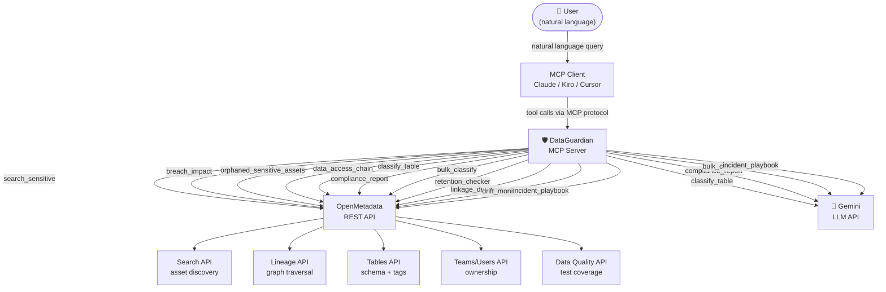
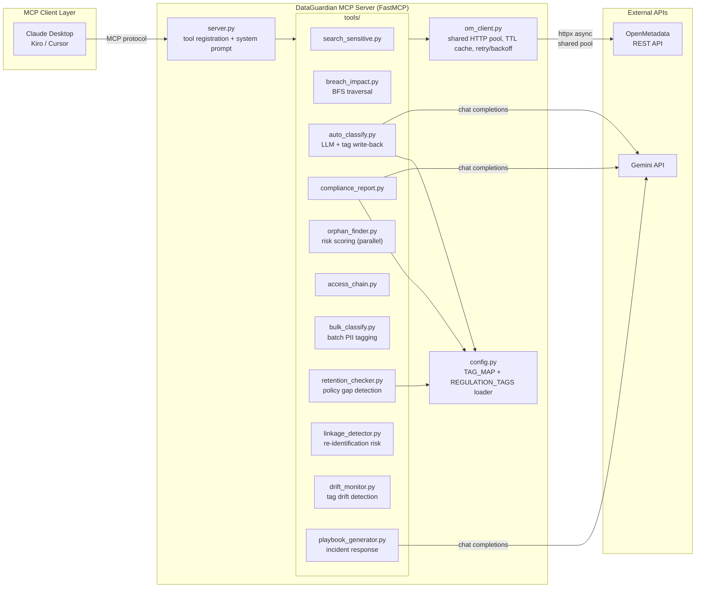
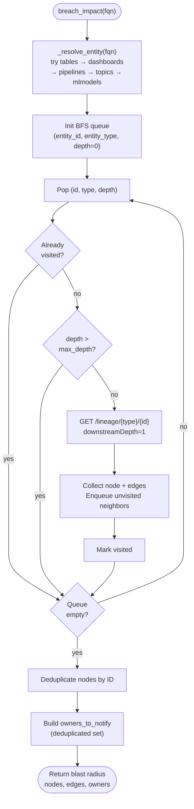
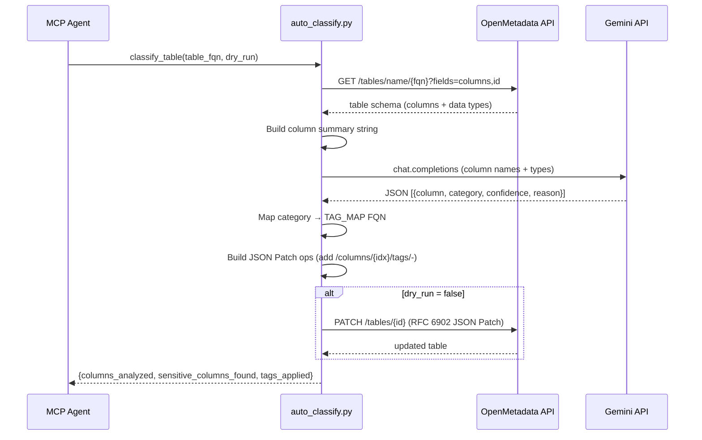
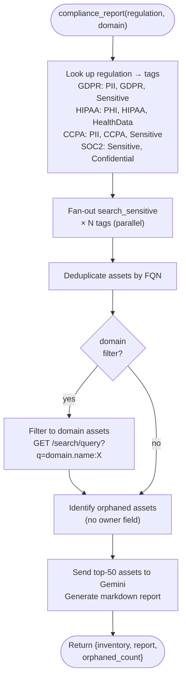
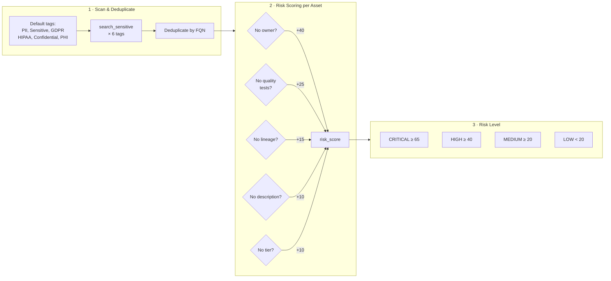
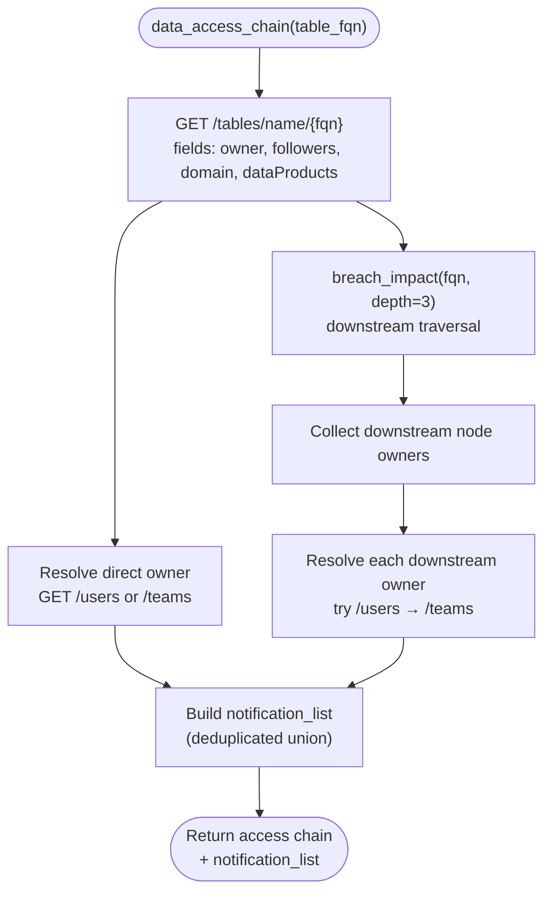
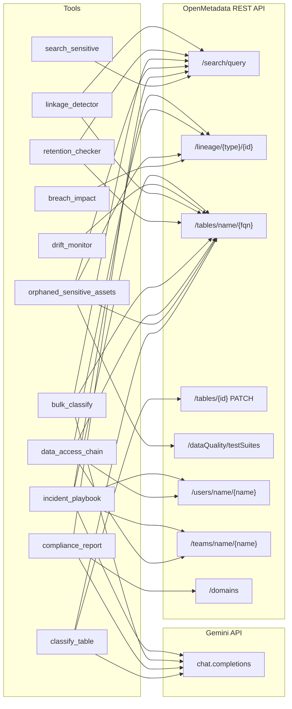

# DataGuardian 🛡️

> AI-powered Compliance & Breach Impact Agent for OpenMetadata

DataGuardian is an MCP server that turns OpenMetadata into an always-on compliance analyst.
Ask natural language questions about your sensitive data — it answers using OpenMetadata's
Search, Lineage, Tags, Governance, Teams, and Data Quality APIs.

---

## Table of Contents

1. [Problem Statement](#1-problem-statement)
2. [What The Platform Does](#2-what-the-platform-does)
3. [System Overview](#3-system-overview)
4. [System Architecture](#4-system-architecture)
5. [Code Structure & Reproducibility](#5-code-structure--reproducibility)
6. [Core Logic Deep Dive](#6-core-logic-deep-dive)
7. [Architecture Decisions](#7-architecture-decisions)
8. [Performance Optimizations](#8-performance-optimizations)
9. [Setup Instructions](#9-setup-instructions)
10. [API Reference](#10-api-reference)
11. [Known Limitations](#11-known-limitations)
12. [What I'd Improve With More Time](#12-what-id-improve-with-more-time)


---

## 1. Problem Statement

When a data breach or compliance audit hits, answering "what's affected and who owns it?" takes days of manual cross-referencing across catalogs, wikis, org charts, and ticketing systems.

Data teams face three compounding problems:

- **Discovery gap** — sensitive data (PII, PHI, financial records) is scattered across hundreds of tables, dashboards, and pipelines with inconsistent or missing tags.
- **Blast radius blindness** — when an asset is compromised, nobody knows which downstream systems, reports, or ML models are affected until it's too late.
- **Governance debt** — sensitive assets accumulate with no owner, no quality tests, and no lineage, making them invisible to compliance teams until an audit or incident forces the issue.

DataGuardian answers all three in seconds, not days.

---

## 2. What The Platform Does

| Tool | What it answers |
|------|----------------|
| `search_sensitive` | Which assets are tagged PII / GDPR / HIPAA / PHI? |
| `breach_impact` | If this table is breached, what's the full blast radius? |
| `classify_table` | Auto-detect PII columns and tag them back in OpenMetadata |
| `compliance_report` | Generate a GDPR Article 30 / HIPAA / CCPA / SOC2 inventory |
| `orphaned_sensitive_assets` | Which sensitive assets have no owner, no tests, or no lineage? |
| `data_access_chain` | Who has access to this table and all downstream assets? |
| `bulk_classify` | Classify all unclassified sensitive tables in one shot |
| `retention_checker` | Find sensitive assets missing retention/expiry policies |
| `linkage_detector` | Detect table pairs that could re-identify individuals when joined |
| `drift_monitor` | Detect when sensitive column tags have been removed |
| `incident_playbook` | Generate a full incident response playbook for a breached asset |

### Example Queries (natural language via any MCP client)

```
"Which tables contain PII data?"
"If payments.transactions was breached, what's the blast radius?"
"Auto-classify the users table and tag any PII columns"
"Generate a GDPR compliance report for our analytics domain"
"Show me all sensitive assets with no owner — our highest risk data"
"Who do I need to notify if the customers table is compromised?"
"Classify all unclassified sensitive tables in our catalog"
"Which sensitive assets are missing a retention policy under GDPR?"
"Are there any table pairs that could re-identify users when joined?"
"Has the users table lost any PII column tags since last week?"
"Generate a GDPR incident playbook for the payments.transactions table"
```

---

## 3. System Overview

DataGuardian sits between your MCP client (Claude Desktop, Kiro, Cursor) and your OpenMetadata instance. It exposes eleven tools that each map to a specific governance workflow:



The LLM (Gemini) is only invoked for tools that require natural language generation: `classify_table` (column-level PII detection), `compliance_report` (narrative generation), `bulk_classify` (delegates to `classify_table`), and `incident_playbook` (notification draft). All other tools are pure API orchestration.

---

## 4. System Architecture



### Component Responsibilities

**`server.py`** — FastMCP server entrypoint. Registers all eleven tools and holds the system prompt that shapes how the LLM agent uses them. Initializes the OpenMetadata client on startup and registers an `atexit` handler to drain the connection pool on shutdown.

**`om_client.py`** — Async HTTP wrapper around the OpenMetadata REST API. Maintains a single shared `httpx.AsyncClient` connection pool for the lifetime of the process. Provides `get`, `put`, and `patch` (JSON Patch / RFC 6902) methods with TTL caching for lineage and team endpoints, and exponential backoff retry for transient errors (429, 502, 503, 504). All tools use this exclusively — no direct HTTP calls in tool code.

**`config.py`** — Loads `TAG_MAP` and `REGULATION_TAGS` from env-specified JSON files, falling back to built-in defaults when the env var is unset, the file is absent, or the file contains invalid JSON. Used by `auto_classify`, `compliance_report`, and `retention_checker`.

**`tools/`** — One file per tool. Each tool is a self-contained async function that composes `om_client` calls and optional LLM calls into a structured response.

---

## 5. Code Structure & Reproducibility

```
dataguardian/
├── dataguardian/
│   ├── __init__.py
│   ├── server.py              # FastMCP server, tool registration
│   ├── om_client.py           # Async OpenMetadata REST client (shared pool, cache, retry)
│   ├── config.py              # Loads TAG_MAP and REGULATION_TAGS from env-specified JSON files
│   └── tools/
│       ├── __init__.py
│       ├── search_sensitive.py    # Tag-based asset search
│       ├── breach_impact.py       # BFS lineage traversal
│       ├── auto_classify.py       # LLM PII classification + tag write-back
│       ├── compliance_report.py   # Regulation-scoped compliance inventory
│       ├── orphan_finder.py       # Risk scoring for ungoverned assets (parallel)
│       ├── access_chain.py        # Ownership + notification chain builder
│       ├── bulk_classify.py       # Batch PII tagging for unclassified tables
│       ├── retention_checker.py   # Retention policy gap detection
│       ├── linkage_detector.py    # Cross-table re-identification risk
│       ├── drift_monitor.py       # Sensitive tag drift detection
│       └── playbook_generator.py  # Incident response playbook generation
├── tests/
│   ├── __init__.py
│   ├── conftest.py
│   ├── unit/                  # Unit tests for each module
│   └── property/              # Hypothesis property-based tests
├── pyproject.toml             # Package definition and dependencies
├── requirements.txt           # Pip-installable dependencies
├── mcp.json                   # MCP client configuration template
└── .env.example               # Environment variable template
```

### Dependencies

| Package | Purpose |
|---------|---------|
| `fastmcp>=2.0.0` | MCP server framework |
| `httpx>=0.27.0` | Async HTTP client for OpenMetadata API |
| `google-generativeai` | Gemini LLM calls for classification and report generation |
| `python-dotenv>=1.0.0` | Environment variable loading |
| `pydantic>=2.0.0` | Data validation |
| `rich>=13.0.0` | Terminal output formatting |

---

## 6. Core Logic Deep Dive

### `search_sensitive` — Tag-based Asset Discovery

Queries the OpenMetadata Search API using `tags.tagFQN:<tag>` against the unified `all` index (or a specific entity index). Results are grouped by entity type and enriched with owner, tier, and tag metadata.

Supported tags out of the box: `PII`, `Sensitive`, `GDPR`, `HIPAA`, `Confidential`, `PHI`.

### `breach_impact` — BFS Lineage Traversal

Implements a breadth-first search over the OpenMetadata lineage graph starting from a given asset FQN. At each hop it fetches the lineage node, collects downstream (or upstream) edges, and enqueues unvisited neighbors up to `max_depth` hops.



The result includes:
- All affected nodes with type, owner, and FQN
- A deduplicated `owners_to_notify` list for incident response
- An `affected_by_type` summary (tables, dashboards, pipelines, ML models)

Entity resolution tries `tables` first, then `dashboards`, `pipelines`, `topics`, and `mlmodels` — the first successful lookup wins.

### `classify_table` — Closed-Loop PII Tagging



1. Fetches the full table schema from OpenMetadata (`/tables/name/{fqn}`)
2. Builds a column summary (name + data type + description) and sends it to Gemini
3. Parses the structured JSON response mapping columns to PII categories
4. Constructs JSON Patch operations (`add` to `/columns/{idx}/tags/-`) for each detected column
5. Applies the patch to OpenMetadata via `PATCH /tables/{id}` (skipped in `dry_run` mode)

Tag FQN mapping (configurable in `TAG_MAP`):

| Category | Tag FQN |
|----------|---------|
| email | `PII.Email` |
| phone | `PII.Phone` |
| ssn | `PII.SSN` |
| name | `PII.Name` |
| address | `PII.Address` |
| date_of_birth | `PII.DateOfBirth` |
| credit_card | `PII.CreditCard` |
| ip_address | `PII.IPAddress` |
| health | `PHI.HealthData` |
| financial | `Sensitive.Financial` |
| password / token | `Sensitive.Credential` |

### `compliance_report` — Regulation-Scoped Inventory

Maps each regulation to a set of relevant tags, then fans out `search_sensitive` calls to collect all matching assets. Deduplicates by FQN, optionally filters by OpenMetadata domain, identifies orphaned assets (no owner), and passes the inventory to Gemini to generate a structured markdown report.



Regulation → tag mapping:

| Regulation | Tags searched |
|------------|--------------|
| GDPR | PII, GDPR, Sensitive |
| HIPAA | PHI, HIPAA, HealthData |
| CCPA | PII, CCPA, Sensitive |
| SOC2 | Sensitive, Confidential |

### `orphaned_sensitive_assets` — Risk Scoring

Scans all sensitive assets across all default tags, deduplicates, then scores each asset:



| Risk Flag | Score |
|-----------|-------|
| NO_OWNER | +40 |
| NO_QUALITY_TESTS | +25 |
| NO_LINEAGE | +15 |
| NO_DESCRIPTION | +10 |
| NO_TIER | +10 |

Risk levels: `CRITICAL` (≥65), `HIGH` (≥40), `MEDIUM` (≥20), `LOW` (<20).

Results are sorted by risk score descending, with `CRITICAL` and `HIGH` assets surfaced first.

### `data_access_chain` — Ownership & Notification

Fetches the table's direct owner, followers, domain, and data products. Resolves the owner's team memberships. Runs a 3-hop downstream lineage traversal to collect all downstream asset owners. Returns a deduplicated `notification_list` ready for incident response.



### `bulk_classify` — Batch PII Tagging

Searches for all sensitive assets, filters to tables that have no existing PII or PHI column-level tags, then runs `classify_table` on each one. Errors on individual tables are captured and do not abort the batch. Returns a summary with per-table results.

### `retention_checker` — Retention Policy Gap Detection

Searches for sensitive assets relevant to the specified regulation, then inspects each asset's description and custom properties for retention-related keywords (`retention`, `expiry`, `expire`, `purge`, `delete_after`, `ttl`). Assets with no matching keywords are classified as `NON_COMPLIANT` and returned with a recommended remediation action.

### `linkage_detector` — Cross-Table Re-Identification Risk

Retrieves all sensitive tables and their PII-tagged column names, then computes pairwise intersections of PII column name patterns. Pairs sharing two or more PII columns are flagged as `MEDIUM` risk; pairs sharing three or more are flagged as `HIGH` risk. Results are sorted by risk level descending.

### `drift_monitor` — Sensitive Tag Drift Detection

On first run, creates a baseline JSON snapshot of a table's column tags at `snapshot_path`. On subsequent runs, compares current tags against the snapshot and reports columns that lost sensitive tags (`DRIFT_DETECTED`) or are unchanged (`NO_DRIFT`). If the snapshot file contains invalid JSON, returns an error without overwriting the file.

### `incident_playbook` — Incident Response Playbook Generation

Combines `breach_impact` (full downstream blast radius) and `data_access_chain` (notification list) with regulation-specific obligations, then uses the LLM to generate a ready-to-send incident notification draft. Short-circuits without calling the LLM if either dependency returns an error.

---

## 7. Architecture Decisions

**FastMCP over raw MCP SDK** — FastMCP provides decorator-based tool registration, automatic schema generation from type hints, and a clean `run()` entrypoint. This keeps `server.py` focused on tool definitions rather than protocol plumbing.

**Single shared `om_client` module** — All tools import from one place. This makes it trivial to swap the HTTP client, add retry logic, or inject auth headers globally without touching tool code.

**Async throughout** — Every tool and HTTP call is `async`. This matters for `compliance_report` and `orphaned_sensitive_assets` which fan out multiple concurrent API calls. Using `httpx.AsyncClient` with a 30-second timeout keeps things responsive without blocking.

**LLM only where necessary** — Gemini is only called in `classify_table`, `compliance_report`, `bulk_classify` (which delegates to `classify_table`), and `incident_playbook`. Everything else is deterministic API orchestration. This keeps costs low and latency predictable for the non-LLM tools.

**BFS with visited set for lineage** — Lineage graphs can have cycles (e.g. a pipeline that reads and writes to the same domain). The visited set in `breach_impact` prevents infinite loops and redundant API calls.

**JSON Patch for tag write-back** — OpenMetadata's column tag API uses RFC 6902 JSON Patch. Using `PATCH` with `add` operations is the correct idiomatic approach — it appends tags without overwriting existing ones.

**`dry_run` mode on classify** — Lets teams preview what would be tagged before committing. Useful for auditing LLM accuracy before enabling automated tagging in production.

---

## 8. Performance Optimizations

- **Shared HTTP connection pool** — `om_client` maintains a single `httpx.AsyncClient` for the lifetime of the process, configured with `max_connections=20` and `max_keepalive_connections=10`. This eliminates per-call TCP handshake overhead for high-frequency tools like `orphan_finder` and `compliance_report`.
- **TTL cache for stable data** — Lineage graph responses (`/lineage/`) and team membership lookups (`/teams/name/`) are cached in memory with a configurable TTL (default 300 seconds via `CACHE_TTL_SECONDS`). Repeated queries within a session hit the cache instead of the API.
- **Retry with exponential backoff** — Transient errors (429, 502, 503, 504) are retried up to `OM_MAX_RETRIES` times (default 3) with delay `base_delay * 2^attempt`. Non-retryable errors (400, 401, 403, 404) raise immediately.
- **Parallel fan-out in `orphan_finder`** — Quality and lineage checks for each asset run concurrently via `asyncio.gather`. Individual check failures are caught and default to `False` without aborting the batch.
- **Deduplication by FQN** — `compliance_report` and `orphan_finder` both fan out multiple tag searches that can return overlapping assets. FQN-based deduplication ensures each asset is processed once.
- **Lineage depth cap** — `LINEAGE_MAX_DEPTH` (default 5, configurable via env) prevents runaway traversal on deeply connected graphs.
- **Asset cap on LLM calls** — `compliance_report` caps the asset list at 50 items before sending to Gemini to stay within token limits. The response includes `truncated` and `truncated_at` fields so callers know when a cap was applied.
- **Entity type resolution short-circuit** — `breach_impact` tries entity types in order of likelihood (tables first) and stops at the first successful lookup.

---

## 9. Setup Instructions

### Prerequisites

- Python 3.11+
- A running OpenMetadata instance (local or cloud)
- Gemini API key (required for `classify_table`, `bulk_classify`, `compliance_report`, and `incident_playbook`) — get one free at [aistudio.google.com](https://aistudio.google.com)

### 1. Install

```bash
cd dataguardian
pip install -e .
```

Or install dependencies directly:

```bash
pip install -r requirements.txt
```

### 2. Configure environment

```bash
cp .env.example .env
```

Edit `.env`:

```env
# OpenMetadata connection
OPENMETADATA_HOST=http://localhost:8585
OPENMETADATA_JWT_TOKEN=your-jwt-token-here

# LLM for auto-classification and compliance reports (Gemini)
GEMINI_API_KEY=your-gemini-api-key-here
GEMINI_MODEL=gemini-2.0-flash

# Optional: max lineage traversal depth (default: 5)
LINEAGE_MAX_DEPTH=5

# Optional: HTTP connection pool — cache TTL and retry settings
CACHE_TTL_SECONDS=300
OM_MAX_RETRIES=3
OM_RETRY_BASE_DELAY_SECONDS=0.5

# Optional: custom tag/regulation mappings (JSON file paths)
# If unset, built-in defaults are used.
# DATAGUARDIAN_TAG_MAP_PATH=/path/to/tag_map.json
# DATAGUARDIAN_REGULATION_TAGS_PATH=/path/to/regulation_tags.json
```

To get your OpenMetadata JWT token: Settings → Bots → Ingestion Bot → copy the token.

To get a Gemini API key: visit [aistudio.google.com](https://aistudio.google.com) — free tier available.

### 3. Run the MCP server

```bash
fastmcp run dataguardian/server.py
```

Or using the installed entrypoint:

```bash
dataguardian
```

### 4. Connect to your MCP client

Copy `mcp.json` to your MCP client's config location and update the environment values.

For Claude Desktop, add to `~/Library/Application Support/Claude/claude_desktop_config.json` (macOS) or `%APPDATA%\Claude\claude_desktop_config.json` (Windows).

For Kiro, add to `.kiro/settings/mcp.json` in your workspace.

---

## 10. API Reference

The diagram below shows which OpenMetadata endpoints each tool calls.



### `search_sensitive`

Search for data assets tagged with a sensitivity label.

| Parameter | Type | Default | Description |
|-----------|------|---------|-------------|
| `tag` | `str` | `"PII"` | Tag to search for: PII, GDPR, HIPAA, PHI, Sensitive, Confidential |
| `entity_type` | `str` | `"all"` | Filter by type: table, dashboard, pipeline, topic, mlmodel, or all |
| `limit` | `int` | `50` | Maximum results to return |

Returns: `{ tag_searched, total_found, assets_by_type }`

---

### `breach_impact`

Traverse the lineage graph from a given asset to find the full blast radius.

| Parameter | Type | Default | Description |
|-----------|------|---------|-------------|
| `fqn` | `str` | required | Fully qualified asset name (e.g. `mysql_prod.analytics.public.users`) |
| `direction` | `str` | `"downstream"` | `downstream` (what's affected) or `upstream` (data sources) |
| `depth` | `int` | `5` | Lineage hops to traverse |

Returns: `{ breached_asset, total_affected, owners_to_notify, affected_by_type, nodes, edges }`

---

### `classify_table`

Auto-classify a table's columns for PII using LLM, then write tags to OpenMetadata.

| Parameter | Type | Default | Description |
|-----------|------|---------|-------------|
| `table_fqn` | `str` | required | Fully qualified table name |
| `dry_run` | `bool` | `False` | Preview tags without writing to OpenMetadata |

Returns: `{ table, dry_run, columns_analyzed, sensitive_columns_found, tags_applied, written_to_openmetadata }`

---

### `compliance_report`

Generate a compliance inventory report for a given regulation.

| Parameter | Type | Default | Description |
|-----------|------|---------|-------------|
| `regulation` | `str` | `"GDPR"` | GDPR, HIPAA, CCPA, or SOC2 |
| `domain` | `str \| None` | `None` | Scope report to an OpenMetadata domain |
| `output_format` | `str` | `"markdown"` | `markdown` or `json` |

Returns: `{ regulation, total_sensitive_assets, orphaned_assets_count, asset_inventory, report }`

---

### `orphaned_sensitive_assets`

Find sensitive assets with no owner, no quality tests, or no lineage.

| Parameter | Type | Default | Description |
|-----------|------|---------|-------------|
| `check_quality` | `bool` | `True` | Flag assets with no data quality test suites |
| `check_lineage` | `bool` | `True` | Flag assets with no lineage connections |

Returns: `{ total_sensitive_assets_scanned, critical_risk_count, high_risk_count, critical_assets, high_risk_assets, all_assets_by_risk }`

---

### `data_access_chain`

Get the complete ownership and access chain for a sensitive table.

| Parameter | Type | Default | Description |
|-----------|------|---------|-------------|
| `table_fqn` | `str` | required | Fully qualified table name |

Returns: `{ table, direct_owner, owner_details, followers, domain, downstream_owners, notification_list }`

---

### `bulk_classify`

Auto-classify all sensitive tables that have no existing PII/PHI column tags.

| Parameter | Type | Default | Description |
|-----------|------|---------|-------------|
| `dry_run` | `bool` | `False` | Preview tags without writing to OpenMetadata |
| `limit` | `int` | `100` | Maximum number of unclassified tables to process |

Returns: `{ dry_run, total_tables_scanned, total_unclassified, total_classified, total_sensitive_columns_found, errors, per_table }`

---

### `retention_checker`

Find sensitive assets that have no retention policy or expiry metadata.

| Parameter | Type | Default | Description |
|-----------|------|---------|-------------|
| `regulation` | `str` | `"GDPR"` | GDPR, HIPAA, CCPA, or SOC2 |
| `domain` | `str \| None` | `None` | Scope scan to an OpenMetadata domain |

Returns: `{ regulation, total_scanned, non_compliant_count, non_compliant_assets, message }`

---

### `linkage_detector`

Detect pairs of tables that could re-identify individuals when joined.

| Parameter | Type | Default | Description |
|-----------|------|---------|-------------|
| `domain` | `str \| None` | `None` | Scope analysis to an OpenMetadata domain |
| `min_shared_columns` | `int` | `2` | Minimum shared PII columns to flag a pair |

Returns: `{ total_tables_analyzed, total_flagged_pairs, flagged_pairs, message }`

---

### `drift_monitor`

Monitor a table for sensitive tag drift — detect removed or added column tags.

| Parameter | Type | Default | Description |
|-----------|------|---------|-------------|
| `table_fqn` | `str` | required | Fully qualified name of the table to monitor |
| `snapshot_path` | `str` | required | File path to save/load the tag snapshot (JSON) |

Returns: `{ table_fqn, snapshot_timestamp, drift_status, lost_tags, gained_tags, error }`

---

### `incident_playbook`

Generate a complete incident response playbook for a breached data asset.

| Parameter | Type | Default | Description |
|-----------|------|---------|-------------|
| `table_fqn` | `str` | required | Fully qualified name of the breached asset |
| `regulation` | `str` | `"GDPR"` | GDPR, HIPAA, CCPA, or SOC2 |
| `incident_description` | `str \| None` | `None` | Optional context about the incident for the LLM |

Returns: `{ breached_asset, regulation, total_affected_assets, notification_list, playbook, error }`

---

### OpenMetadata APIs Used

| Endpoint | Used by |
|----------|---------|
| `GET /api/v1/search/query` | search_sensitive, compliance_report, orphan_finder |
| `GET /api/v1/lineage/{type}/{id}` | breach_impact, access_chain |
| `GET /api/v1/tables/name/{fqn}` | classify_table, access_chain, orphan_finder |
| `PATCH /api/v1/tables/{id}` | classify_table (tag write-back) |
| `GET /api/v1/dataQuality/testSuites` | orphan_finder |
| `GET /api/v1/users/name/{name}` | access_chain |
| `GET /api/v1/teams/name/{name}` | access_chain |
| `GET /api/v1/domains` | compliance_report (domain filter) |

---

## 11. Known Limitations

- **OpenMetadata version compatibility** — Tested against OpenMetadata 1.x REST API. Lineage and tag endpoints may differ on older versions.
- **LLM accuracy on classify_table** — PII detection quality depends on column names and descriptions. Columns with cryptic names (e.g. `col_a`, `field_23`) and no descriptions will have lower confidence. Always review `dry_run` output before enabling automated tagging.
- **Token limits on compliance_report** — The asset list is capped at 50 items before being sent to Gemini. Large catalogs with hundreds of sensitive assets will produce reports based on a sample. The response includes `truncated` and `truncated_at` fields to make this visible.
- **No authentication beyond JWT** — Only Bearer token auth is supported. OAuth, mTLS, or API key auth would require changes to `om_client.py`.
- **Lineage graph cycles** — The BFS visited set prevents infinite loops, but very large or densely connected lineage graphs may hit the depth cap before full traversal.
- **Single OpenMetadata instance** — The client is initialized once at startup from environment variables. Multi-tenant or multi-instance setups are not supported.
- **Drift monitor snapshot is local** — The tag snapshot is stored as a local JSON file. In distributed or containerized deployments, the snapshot path must be on a shared or persistent volume.

---

## 12. What I'd Improve With More Time

- **Streaming compliance reports** — Large compliance reports currently block until the full LLM response is ready. Streaming the response back through the MCP tool would improve perceived responsiveness.

- **Caching for lineage and ownership** — Lineage graphs and team memberships are cached with a TTL, but the cache is in-process and lost on restart. A distributed cache (e.g. Redis) would persist across restarts and share state across multiple server instances.

- **Test suite coverage for new tools** — Unit tests and property-based tests for `bulk_classify`, `retention_checker`, `linkage_detector`, `drift_monitor`, and `playbook_generator` would increase confidence in edge-case behavior.

- **Support for more entity types in breach_impact** — Currently resolves FQNs as tables, dashboards, pipelines, topics, and ML models. Stored procedures and data products are not yet handled.

- **Drift monitor remote snapshot storage** — The tag snapshot is stored as a local JSON file. Supporting remote storage (S3, GCS, or OpenMetadata custom properties) would make drift monitoring viable in containerized deployments.

- **OAuth / mTLS support in om_client** — Only Bearer token auth is currently supported. Adding OAuth 2.0 or mTLS would enable DataGuardian to work with OpenMetadata instances that enforce stronger authentication.
